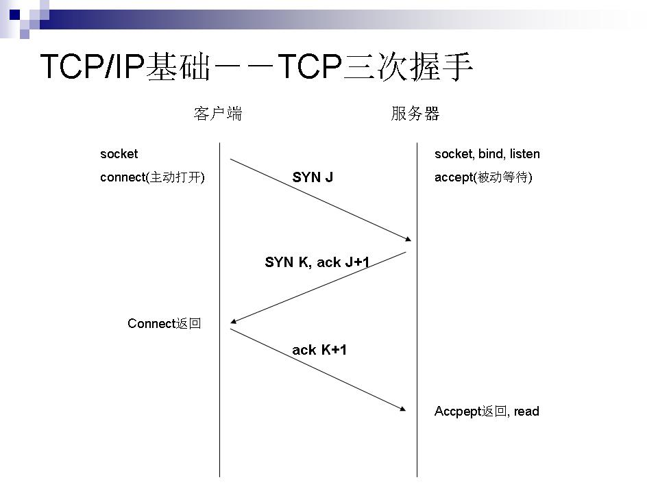

## 原型
JavaScript 是基于原型的语言。

- 每个函数都有 `prototype` 属性。
- 每个对象都有 `__proto__` 属性，指向这个对象的构造函数的 `prototype` 属性。
- `prototype` 也是一个对象，也有 `__proto__` 属性，指向 `Object.prototype`，`Object.prototype` 的 `__proto__` 是 `null`。
- `prototype` 还有一个 `constructor` 属性，指向构造函数本身。
- 关系如下图所示：
    
- `Object.create()` 方法创建一个新对象，使用现有的对象来提供新创建的对象的 `__proto__`。通过这个方法来继承：`Child.prototype = Object.create(Parent.prototype)`

## 原型链
当获取一个对象的属性时，会先从对象本身寻找，如果没有再到对象的 `__proto__` 寻找，还没有就再到对象的 `__proto__` 的 `__proto__` 寻找，直到 `Object.prototype`。

## 继承
### 通过原型链继承
1. 定义一个父类，添加属性和方法
    ``` javascript
    function Person (name, age) {
        this.name = name
        this.age = age
    }
    Person.prototype.sayHi = function () {
        console.log(`Hi, i'm ${this.name}.`)
    }
    ```
2. 定义子类，在子类的构造函数里调用父类构造函数，添加自己的属性，添加自己的方法或重写方法
    ``` javascript
    function Teacher (name, age, subject) {
        Person.call(this, name, age)

        this.subject = subject
    }
    Person.prototype.sayHi = function () {
        console.log(`Hi, i'm ${this.name}, i'm ${this.subject} teacher.`)
    }
    ```
3. 将子类的 `prototype.__proto__` 指向父类的 `prototype` 
    ```js{8}
    function Teacher (name, age, subject) {
        Person.call(this, name, age)

        this.subject = subject
    }

    // `Object.create()` 方法创建一个新对象，使用现有的对象来提供新创建的对象的 `__proto__`。通过这个方法来继承
    Teacher.prototype = Object.create(Person.prototype)

    Person.prototype.sayHi = function () {
        console.log(`Hi, i'm ${this.name}, i'm ${this.subject} teacher.`)
    }
    ```
4. 上面一步操作后，子类的 `prototype.constructor` 将会指向父类的构造函数，需要修改为子类构造函数
    ```js{9}
    function Teacher (name, age, subject) {
        Person.call(this, name, age)

        this.subject = subject
    }

    // `Object.create()` 方法创建一个新对象，使用现有的对象来提供新创建的对象的 `__proto__`。通过这个方法来继承
    Teacher.prototype = Object.create(Person.prototype)
    Teacher.prototype.constructor = Teacher

    Person.prototype.sayHi = function () {
        console.log(`Hi, i'm ${this.name}, i'm ${this.subject} teacher.`)
    }
    ```
### 几种继承的区别
https://github.com/mqyqingfeng/Blog/issues/16

## Class

## this
### this指向
- 在全局环境中 this 指向全局对象
    - 浏览器中是 window
    - node 环境中是 global
    - web worker 中是 self
    - 可以用 **globalThis** 在不同环境中获取全局 this 对象

- 在函数中谁调用 this 就指向谁
    - 可以通过 call 和 apply 改变函数的 this 指向
        ```javascript
        // 对象可以作为 bind 或 apply 的第一个参数传递，并且该参数将绑定到该对象。
        var obj = {a: 'Custom'};

        // 声明一个变量，并将该变量作为全局对象 window 的属性。
        var a = 'Global';

        function whatsThis() {
        return this.a;  // this 的值取决于函数被调用的方式
        }

        whatsThis();          // 'Global' 因为在这个函数中 this 没有被设定，所以它默认为 全局/ window 对象
        whatsThis.call(obj);  // 'Custom' 因为函数中的 this 被设置为obj
        whatsThis.apply(obj); // 'Custom' 因为函数中的 this 被设置为obj

        // --------------------------------------------------------

        function add(c, d) {
            return this.a + this.b + c + d;
        }

        var o = {a: 1, b: 3};

        // 第一个参数是用作“this”的对象
        // 其余参数用作函数的参数
        add.call(o, 5, 7); // 16

        // 第一个参数是用作“this”的对象
        // 第二个参数是一个数组，数组中的两个成员用作函数参数
        add.apply(o, [10, 20]); // 34
        ```
    - 可以使用 bind 创建一个固定 this 的新函数
        ``` javascript
        function f(){
            return this.a;
        }

        var g = f.bind({a:"azerty"});
        console.log(g()); // azerty

        var h = g.bind({a:'yoo'}); // bind只生效一次！
        console.log(h()); // azerty

        var o = {a:37, f:f, g:g, h:h};
        console.log(o.a, o.f(), o.g(), o.h()); // 37, 37, azerty, azerty
        ```
    - 严格模式和非严格模式有区别
        ``` javascript
        function f1(){
            return this;
        }
        //在浏览器中：
        f1() === window;   //在浏览器中，全局对象是window

        //在Node中：
        f1() === globalThis;

        function f2(){
            "use strict"; // 这里是严格模式
            return this;
        }

        f2() === undefined; // true
        ```
    - 箭头函数中，this与封闭词法环境的this保持一致
        ``` javascript
        var globalObject = this;
        var foo = (() => this);
        console.log(foo() === globalObject); // true
        ```

- js中函数的范围很广，以下列举各种情况
    - 当函数作为对象里的方法被调用时，this 被设置为**调用该函数的对象**。
        ``` javascript
        var o = {
            prop: 37,
            f: function() {
                return this.prop;
            }
        };

        console.log(o.f()); // 37
        // 这里调用 f 的是 o，所以 this 指向 o；如果是 o.d.f()，那么 this 就指向 d
        ```
    - 原型链中的 this 同上
    - getter 和 setter 中的 this 同上
    - 构造函数中的 this 指向被构造的对象
        ``` javascript
        function C (val) {
            this.a = val;
        }

        var o = new C(2);

        console.log(o.a); // logs 2
        ```
    - DOM事件处理函数中的 this 指向触发事件的元素
        ``` javascript
        // 被调用时，将关联的元素变成蓝色
        function bluify(e){
            console.log(this === e.currentTarget); // 总是 true

            // 当 currentTarget 和 target 是同一个对象时为 true
            console.log(this === e.target);
            this.style.backgroundColor = '#A5D9F3';
        }

        // 获取文档中的所有元素的列表
        var elements = document.getElementsByTagName('*');

        // 将bluify作为元素的点击监听函数，当元素被点击时，就会变成蓝色
        for(var i=0 ; i<elements.length ; i++){
            elements[i].addEventListener('click', bluify, false);
        }
        ```
    - 内联事件处理函数中的 this 指向监听器所在的DOM元素
        ``` javascript
        <button onclick="alert(this.tagName.toLowerCase());">
            Show this
        </button>
        // alert 会显示 button
        ```


### 实现bind
bind特点：
- 传入 this，返回一个固定 this 的函数
- 传入预置参数，调用返回的新函数时可以传入补充参数
- 返回的新函数可以使用 new，原先传入的 this 会被忽略，预置参数仍有效
``` javascript
function func1(x, y) {
    this.x = x;
    this.y = y;
}
const obj = {}
var func2 = func1.bind(obj, 1)
func2(2)
console.log(obj.x, obj.y) // 1 2

const obj2 = new func2(3)
console.log(obj2.x, obj2.y) // 2, 3
console.log(obj2 instanceof func1) // true
console.log(obj2 instanceof func2) // true
```
**借助 call 或 apply 实现 bind：**
1. 第一步，传入 this 并返回一个新函数
    ``` javascript
    Function.prototype.myBind = function (thisArg) {
        var that = this
        return function () {
            return that.apply(thisArg, [...arguments])
        }
    }
    ```

2. 第二步，传入预置参数
    ``` javascript
    Function.prototype.myBind = function (thisArg, ...arg) {
        var that = this
        return function () {
            return that.apply(thisArg, arg.concat([...arguments]))
        }
    }
    ```
    这里用了 [解构语法](https://developer.mozilla.org/zh-CN/docs/Web/JavaScript/Reference/Operators/Destructuring_assignment#%E8%AF%AD%E6%B3%95) 取函数传参，也可以用 `Array.prototype.slice` 方法从 arguments 截取。

3. 第三步，支持 new
    ``` javascript
    Function.prototype.myBind = function (thisArg, ...arg) {
        if (typeof this !== "function") {
            throw new Error("Function.prototype.bind - what is trying to be bound is not callable");
        }

        var that = this
        var newFunc = function () {
            return that.apply(this instanceof newFunc ? this : thisArg, arg.concat([...arguments]))
        }
        newFunc.prototype = Object.create(this.prototype)
        return newFunc
    }
    ```
    - 如果不是函数调用 bind，抛出错误
    - `this instanceof newFunc` 区分是普通函数调用还是构造函数调用
    - 使用 `Object.create` 让新函数继承原函数

**不借助 call 或 apply 实现 bind**

那就先自己实现一个call 或 apply
- 将原本的函数添加到传入的 this 属性里
- 调用这个函数
- 删除添加的属性
- 返回函数执行结果
- call 和 apply 只是传参格式不同，使用解构赋值可以很方便取值，如果不使用 es6 语法，则需要循环 arguments，拼接之后通过 eval 执行函数

### 实现call
``` javascript
Function.prototype.myCall = function (thisArg, ...arg) {
    thisArg.fn = this
    var result = thisArg.fn(...arg)
    delete thisArg.fn
    return result
}
```

### 实现apply
``` javascript
Function.prototype.myApply = function (thisArg, arg) {
    thisArg.fn = this
    var result = thisArg.fn(...arg)
    delete thisArg.fn
    return result
}
```

## 数据类型
- JS拥有动态类型，相同变量可⽤作不同类型
- typeof返回string、number、boolean、object、function、symbol、undefined
- typeof数组返回object，typeof null 返回object
- undefined、空值、null。没有值的变量是undefined、空值是空字符串、null == undefined返回true、null === undefined返回false
- instanceof可以检测Array类型。object(要检测的对象) instanceof constructor(某个构造函数)，instanceof⽤来检测
- constructor.prototype是否存在于object的原型链上
- Object.prototype.toString.call(obj)
## 事件循环
宏任务和微任务：
- 宏任务：**script全部代码**、setTimeout、setInterval、setImmediate（只有IE10支持）、I/O、UI Rendering。
- 微任务：Process.nextTick（Node独有）、Promise、Object.observe(废弃)、MutationObserver
### 浏览器环境
有一个**主线程**和**调用栈**，所有的任务都会被放到调用栈中等待主线程执行。

同步任务会在调用栈中被主线程依次执行，异步任务会在**有了结果后将回调函数放入任务队列**，微任务放到微任务队列，宏任务放到宏任务队列。当调用栈空了之后会按顺序把微任务放入调用栈执行，当微任务队列空了之后会按顺序把宏任务放入调用栈执行，如此循环。

以下代码的打印顺序：
``` js
async function async1() {
    console.log('p1')
    await async2()
    console.log('p2')
}
async function async2() {
    console.log('p3')
}
console.log('p4')
setTimeout(() => {
    console.log('p5')
}, 0)
async1()
new Promise(resolve => {
    console.log('p6')
    resolve()
})
.then(() => {
    console.log('p7')
})
console.log('p8') 

//p4 p1 p3 p6 p8 p2 p7 p5
```
### node环境
https://zhuanlan.zhihu.com/p/54882306

## js异步
### Promise
### Generate
### async/await
## new
https://github.com/mqyqingfeng/Blog/issues/13
## 闭包

## 正则

## event
### event 类 on once 等方法
### 点击table的td显示td内容

## 类型转换

## http
### http 握手
1. 客户端发送syn包(syn=j)到服务器，并进入SYN_SEND状态，等待服务器确认；
2. 服务器收到syn包，必须确认客户的SYN（ack=j+1），同时自己也发送一个SYN包（syn=k），即SYN+ACK包，此时服务器进入SYN_RECV状态；
3. 客户端收到服务器的SYN＋ACK包，向服务器发送确认包ACK(ack=k+1)，此包发送完毕，客户端和服务器进入ESTABLISHED状态，完成三次握手。


### http 状态码
https://developer.mozilla.org/zh-CN/docs/Web/HTTP/Status

信息响应(100–199)，成功响应(200–299)，重定向(300–399)，客户端错误(400–499)和服务器错误 (500–599)。

- 301 Moved Permanently。
被请求的资源已永久移动到新位置，并且将来任何对此资源的引用都应该使用本响应返回的若干个 URI 之一。如果可能，拥有链接编辑功能的客户端应当自动把请求的地址修改为从服务器反馈回来的地址。除非额外指定，否则这个响应也是可缓存的。


- 302 Found。
请求的资源现在临时从不同的 URI 响应请求。由于这样的重定向是临时的，客户端应当继续向原有地址发送以后的请求。只有在Cache-Control或Expires中进行了指定的情况下，这个响应才是可缓存的。

- 304 Not Modified。
如果客户端发送了一个带条件的 GET 请求且该请求已被允许，而文档的内容（自上次访问以来或者根据请求的条件）并没有改变，则服务器应当返回这个状态码。304 响应禁止包含消息体，因此始终以消息头后的第一个空行结尾。

- 400 Bad Request。
1、语义有误，当前请求无法被服务器理解。除非进行修改，否则客户端不应该重复提交这个请求。
2、请求参数有误。

- 401 Unauthorized。
当前请求需要用户验证。该响应必须包含一个适用于被请求资源的 WWW-Authenticate 信息头用以询问用户信息。客户端可以重复提交一个包含恰当的 Authorization 头信息的请求。如果当前请求已经包含了 Authorization 证书，那么401响应代表着服务器验证已经拒绝了那些证书。如果401响应包含了与前一个响应相同的身份验证询问，且浏览器已经至少尝试了一次验证，那么浏览器应当向用户展示响应中包含的实体信息，因为这个实体信息中可能包含了相关诊断信息。

- 403 Forbidden。
服务器已经理解请求，但是拒绝执行它。与 401 响应不同的是，身份验证并不能提供任何帮助，而且这个请求也不应该被重复提交。如果这不是一个 HEAD 请求，而且服务器希望能够讲清楚为何请求不能被执行，那么就应该在实体内描述拒绝的原因。当然服务器也可以返回一个 404 响应，假如它不希望让客户端获得任何信息。

- 404 Not Found。
请求失败，请求所希望得到的资源未被在服务器上发现。没有信息能够告诉用户这个状况到底是暂时的还是永久的。假如服务器知道情况的话，应当使用410状态码来告知旧资源因为某些内部的配置机制问题，已经永久的不可用，而且没有任何可以跳转的地址。404这个状态码被广泛应用于当服务器不想揭示到底为何请求被拒绝或者没有其他适合的响应可用的情况下。

- 405 Method Not Allowed。
请求行中指定的请求方法不能被用于请求相应的资源。该响应必须返回一个Allow 头信息用以表示出当前资源能够接受的请求方法的列表。 鉴于 PUT，DELETE 方法会对服务器上的资源进行写操作，因而绝大部分的网页服务器都不支持或者在默认配置下不允许上述请求方法，对于此类请求均会返回405错误。

- 415 Unsupported Media Type。
对于当前请求的方法和所请求的资源，请求中提交的实体并不是服务器中所支持的格式，因此请求被拒绝。

- 500 Internal Server Error。
服务器遇到了不知道如何处理的情况。

- 501 Not Implemented。
此请求方法不被服务器支持且无法被处理。只有GET和HEAD是要求服务器支持的，它们必定不会返回此错误代码。

- 502 Bad Gateway。
此错误响应表明服务器作为网关需要得到一个处理这个请求的响应，但是得到一个错误的响应。

- 503 Service Unavailable。
服务器没有准备好处理请求。 常见原因是服务器因维护或重载而停机。 请注意，与此响应一起，应发送解释问题的用户友好页面。 这个响应应该用于临时条件和 Retry-After：如果可能的话，HTTP头应该包含恢复服务之前的估计时间。 网站管理员还必须注意与此响应一起发送的与缓存相关的标头，因为这些临时条件响应通常不应被缓存。

- 504 Gateway Timeout。
当服务器作为网关，不能及时得到响应时返回此错误代码。

- 505 HTTP Version Not Supported。
服务器不支持请求中所使用的HTTP协议版本。

### http 请求方法
https://developer.mozilla.org/zh-CN/docs/Web/HTTP/Methods

- GET。
GET方法请求一个指定资源的表示形式，使用GET的请求应该只被用于获取数据。
- HEAD。
HEAD方法请求一个与GET请求的响应相同的响应，但没有响应体。
- POST。
POST方法用于将实体提交到指定的资源，通常导致在服务器上的状态变化或副作用。
- PUT。
PUT方法用请求有效载荷替换目标资源的所有当前表示。
- DELETE。
DELETE方法删除指定的资源。
- CONNECT。
CONNECT方法建立一个到由目标资源标识的服务器的隧道。
- OPTIONS。
OPTIONS方法用于描述目标资源的通信选项。
- TRACE。
TRACE方法沿着到目标资源的路径执行一个消息环回测试。
- PATCH。
PATCH方法用于对资源应用部分修改。

### http header
https://developer.mozilla.org/zh-CN/docs/Web/HTTP/Headers

### http 组成部分
HTTP 请求和响应具有相似的结构，由以下部分组成︰
1. 一行起始行用于描述要执行的请求，或者是对应的状态，成功或失败。这个起始行总是单行的。
2. 一个可选的HTTP头集合指明请求或描述消息正文。
3. 一个空行指示所有关于请求的元数据已经发送完毕。
4. 一个可选的包含请求相关数据的正文 (比如HTML表单内容), 或者响应相关的文档。 正文的大小有起始行的HTTP头来指定。


### http 请求幂等性
一个HTTP方法是幂等的，指的是同样的请求被执行一次与连续执行多次的效果是一样的，服务器的状态也是一样的。

https://developer.mozilla.org/zh-CN/docs/Glossary/Idempotent
### http2
HTTP/1.x 报文有一些性能上的缺点：

1. Header 不像 body，它不会被压缩。
2. 两个报文之间的 header 通常非常相似，但它们仍然在连接中重复传输。
3. 无法复用。当在同一个服务器打开几个连接时：TCP 热连接比冷连接更加有效。

HTTP/2 引入了一个额外的步骤：它将 HTTP/1.x 消息分成帧并嵌入到流 (stream) 中。数据帧和报头帧分离，这将允许报头压缩。将多个流组合，这是一个被称为 多路复用 (multiplexing) 的过程，它允许更有效的底层 TCP 连接。

HTTP 帧现在对 Web 开发人员是透明的。在 HTTP/2 中，这是一个在  HTTP/1.1 和底层传输协议之间附加的步骤。Web 开发人员不需要在其使用的 API 中做任何更改来利用 HTTP 帧；当浏览器和服务器都可用时，HTTP/2 将被打开并使用。


### https
HTTPS （安全的HTTP）是 HTTP 协议的加密版本。它通常使用 SSL (en-US) 或者 TLS 来加密客户端和服务器之间所有的通信 。这安全的链接允许客户端与服务器安全地交换敏感的数据。

采用HTTPS协议的服务器必须要有一套数字证书，可以是自己制作或者CA证书。区别就是自己颁发的证书需要客户端验证通过，才可以继续访问，而使用CA证书则不会弹出提示页面。这套证书其实就是一对公钥和私钥。公钥给别人加密使用，私钥给自己解密使用。

### https 握手
1. 客户端发起https请求，服务端收到请求后把证书公钥返回。
2. 客户端收到证书信息后验证证书是否有效，无效则通知客户端需要用户手动验证通过。验证通过后生成一个随机值使用证书公钥加密后发送给服务端。
3. 服务端将收到的随机数解密，再使用这个随机数加密需要返回的信息。
4. 客户端解密信息。


## 跨域

## 回流重绘

## canvas

## cookie
## vue
### MVVM如何实现
### 双向绑定原理
### 组合式api实现原理
### vue3 对比 vue2
- 组合式API
- Teleport
- 组件支持多个根节点
- 使用 `createApp` 创建实例，原本在Vue上的全局api也转移到了实例上
- 全局api使用具名导出的方式，支持tree-shaking
- v-model 语法变更
- key
    - 对于 v-if/v-else/v-else-if 的各分支项 key 将不再是必须的，因为现在 Vue 会自动生成唯一的 key。
    - `<template v-for>` 的 key 应该设置在 `<template>` 标签上
- 两者作用于同一个元素上时，v-if 会拥有比 v-for 更高的优先级。
- 一个元素同时定义了 `v-bind="object"` 和一个相同的独立 attribute，那么绑定的声明顺序将决定它们如何被合并
- `v-on` 的 `.native` 修饰符已被移除，组件件事件现在需要在 `emits` 选项中声明
- `v-for` 中的 ref 不再注册 ref 数组
- 异步组件现在需要使用 defineAsyncComponent 方法来创建
- 使用 `Proxy` 代替 `Object.defineProperty`，`Object.defineProperty` 有以下缺点：
    - 通过下标的方式直接修改属性的值，或者添加一个预先不存在的属性，是无法监听到数据变化的
    - 需要对每个对象的属性进行遍历，如果，属性值是对象，还需要深度遍历
- 新增了静态标记，对于标记了静态标记的标签，diff时不再对比
- 绑定的方法会被缓存起来，下次更新直接复用
### 异步渲染
Vue 在更新 DOM 时是异步执行的。只要侦听到数据变化，Vue 将开启一个队列，并缓冲在同一事件循环中发生的所有数据变更。如果同一个 watcher 被多次触发，只会被推入到队列中一次。这种在缓冲时去除重复数据对于避免不必要的计算和 DOM 操作是非常重要的。然后，在下一个的事件循环“tick”中，Vue 刷新队列并执行实际 (已去重的) 工作。Vue 在内部对异步队列尝试使用原生的 Promise.then、MutationObserver 和 setImmediate，如果执行环境不支持，则会采用 setTimeout(fn, 0) 代替。
### diff原理
https://zhuanlan.zhihu.com/p/149972619

https://zhuanlan.zhihu.com/p/369557715

## webpack
### webpack 打包原理
webpack 是一个现代 JavaScript 应用程序的静态模块打包器(module bundler)。当 webpack 处理应用程序时，它会递归地构建一个依赖关系图(dependency graph)，其中包含应用程序需要的每个模块，然后将所有这些模块打包成一个或多个 bundle。
### webpack 核心概念
1. entry。入口起点(entry point)指示 webpack 应该使用哪个模块，来作为构建其内部依赖图的开始。进入入口起点后，webpack 会找出有哪些模块和库是入口起点（直接和间接）依赖的。
2. output。output 属性告诉 webpack 在哪里输出它所创建的 bundles，以及如何命名这些文件，默认值为 ./dist。基本上，整个应用程序结构，都会被编译到你指定的输出路径的文件夹中。
3. loader。loader 让 webpack 能够去处理那些非 JavaScript 文件（webpack 自身只理解 JavaScript）。loader 可以将所有类型的文件转换为 webpack 能够处理的有效模块，然后你就可以利用 webpack 的打包能力，对它们进行处理。
4. plugin。loader 被用于转换某些类型的模块，而插件则可以用于执行范围更广的任务。插件的范围包括，从打包优化和压缩，一直到重新定义环境中的变量。插件接口功能极其强大，可以用来处理各种各样的任务。

### webpack5
https://webpack.docschina.org/blog/2020-10-10-webpack-5-release/

这个版本的重点在于以下几点。
- 尝试用持久性缓存来提高构建性能。
- 尝试用更好的算法和默认值来改进长期缓存。
- 尝试用更好的 Tree Shaking 和代码生成来改善包大小。
- 尝试改善与网络平台的兼容性。
- 尝试在不引入任何破坏性变化的情况下，清理那些在实现 v4 功能时处于奇怪状态的内部结构。
- 试图通过现在引入突破性的变化来为未来的功能做准备，使其能够尽可能长时间地保持在 v5 版本上。


## html
### 从输⼊url到展示⽹⻚
1. DNS解析成IP，可以使⽤dns-prefetch在浏览器空闲的时候解析
2. 发送http请求
3. 建⽴tcp连接
4. 传输数据
5. 解析HTML构建dom树
6. 解析CSS结合dom树构建render树
7. 布局render树
8. 绘制render树

### 浏览器缓存
相关请求头：Cache-Control、Expires、Etag、If-None-Match、If-Modified-Since、Last-Modified：
- Cache-Control（http1.1）优先级高于Expires（http1.0）
- Etag/If-None-Match优先级高于If-Modified-Since/Last-Modified

缓存逻辑：
1. 第⼀次访问时，向服务器发送请求，成功收到响应，返回200，浏览器下载资源⽂件，并记录下response header和返回时间。
2. 再次访问相同资源时，本地先判断是否需要发送请求给服务端：
    - ⽐较当前时间和上⼀次返回200时的时间差（使用Cache-Control或Expires），如果未超过过期时间，则命中强缓存，读取本地缓存资源
    - 如果过期了，则向服务器发送header带有Etag/If-None-Match或If-Modified-Since/Last-Modified的请求
3. 服务器收到请求后，根据header内容判断被请求的⽂件有没有做修改，没有修改则命中协商缓存，返回304；有改动则直接返回新的资源⽂件带上新的header并返回200。

### meta标签
## css
### 盒模型
- 浏览器渲染时会根据盒模型把元素表示成⼀个个矩形的盒⼦。css决定盒⼦的⼤⼩、位置、属性
- 每个盒⼦有四部分：content、padding、border、margin
- box-sizing: content-box（默认）。width、height、min-height、max-height、min-width、max-width控制content区域⼤⼩
- box-sizing: border-box（ie怪异盒模型）。width、height、min-height、max-height、min-width、max-width控制content+padding+border⼤⼩
- 如果盒⼦上有背景（background-color或background-image），背景会延伸⾄border外沿，border盖在背景上。可通过background-clip设置，border-box（默认）、padding-box、content-box、text分别设置延伸⾄border、padding、content和text外沿
### bfc 块级格式化上下文
盒模型布局是⽤BFC模式渲染的。浮动，绝对定位元素，inline-blocks, table-cells, table-captions,和overflow的值不为visible的元素，将创建⼀个新的块级格式化上下⽂。
- BFC内部元素不会伸出盒⼦。⽐如float，margin不撑开⽗元素
- BFC不会围绕浮动元素
- BFC内垂直⽅向的距离由较⼤的margin决定，⽽不是margin相加
通常会使⽤overflow来创建BFC。不引起任何副作⽤可以使⽤display: flow-root。
### 上中下布局
### <link/>为什么要放在头部
