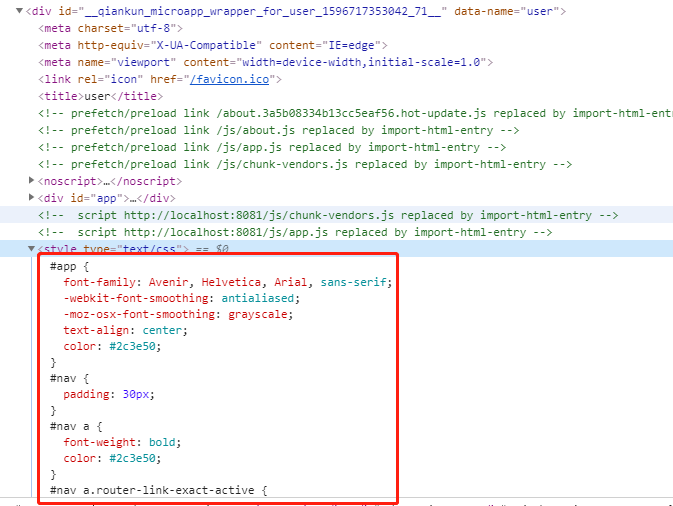

# 常见问题
## JS沙箱
目前子应用和子应用、主应用和子应用之前没有发现会有影响的地方
## 样式隔离
默认情况下沙箱可以确保单实例场景子应用之间的样式隔离，查看页面代码可以发现子应用的css全部被转化为了页面内联样式，所以只要应用卸载了，样式就不会继续存在。

但是无法确保主应用跟子应用、或者多实例场景的子应用样式隔离，前面提到的strictStyleIsolation 和 experimentalStyleIsolation目前还不能直接使用，只能通过规范来尽可能避免样式污染：
#### 组件样式加上scoped
尽量都加上
#### 使用 CSS Modules 方案管理样式
无论是框架应用还是子应用，直接通过 CSS Modules 的方案管理自身可控的样式，这样基本杜绝了两者样式冲突的问题。由于CSS Modules只会转换class，所以尽量不要使用id选择器写样式，这也是一般的规范。如果无法约束子应用不使用id选择器，可以在主应用的id命名使用特殊的前缀，比如一般vue挂载节点都是 #app，主应用可以使用 #bdrMainApp。
#### 框架应用自定义基础组件 prefix
除了自身可控的样式，应用中还会有一些全局样式，比较典型的就是ui框架的样式，如果框架应用和子应用使用了不同版本的同一个ui框架 ，则很容易造成样式相互污染，这种场景推荐在框架应用中将基础组件的前缀统一改掉。以ant-design-vue为例，可以使用以下代码添加prefix：
```html
// webpack配置
css: {
  loaderOptions: {
    less: {
      modifyVars: {
        'ant-prefix': 'ant-bdr'
      }
    }
  }
}

// 根组件
// 这个属性在antdv文档里没有写，但是支持
// 在antd文档里有:https://ant-design.gitee.io/components/config-provider-cn/
<a-config-provider prefixCls="ant-bdr">
  <div id="app"></div>
</a-config-provider>
```
#### 子应用避免产生全局样式
对于类似 `normalize.css` 这种全局重置样式，推荐统一通过框架应用引入，子应用尽量避免产生全局性质的样式，因为这样在切换子应用时可能会因为全局样式差异产生一些抖动。
## 兼容IE
建议直接使用 @babel/preset-env 插件完成自动引入 IE 需要的 polyfill 的能力，所有的操作文档都可以在 [babel 官方文档](https://babeljs.io/docs/en/babel-preset-env) 找到。也可以查看[这篇文章](https://www.yuque.com/kuitos/gky7yw/qskte2)来获取更多 IE 兼容相关的知识。
## 已知问题
#### element-ui icon无法显示
[https://github.com/umijs/qiankun/issues/217#issuecomment-644550750](https://github.com/umijs/qiankun/issues/217#issuecomment-644550750)
由于icon字体加载失败导致的。原因是开启了 [css.extra](https://cli.vuejs.org/zh/config/#css-extract) 后，样式会被提取为单独的文件，样式文件内通过相对路径引入字体文件（../../fonts/element-icon.woff），在qiankun环境内就变成了引用主应用域名下的资源，显然就会404了。需要注意即使没有开启css.extra在本地环境没问题，但是生产环境构建是会自动开启的，除非手动设置为了false。解决办法是在修改url-loader的publicPath配置：
```javascript
const _ = require('lodash')
chainWebpack: config => {
  config.module
    .rule('fonts')
    .use('url-loader')
    .tap(options => _.merge(options, {
    fallback: {
      options: { // file-loader 的 options
        publicPath: process.env.NODE_ENV === 'development' ? `//localhost:${port}` : process.env.VUE_APP_DOMAIN
      }
    }
  }))
}
```
其他静态资源加载失败的问题也可以用类似方法解决，需注意配置好不同环境的publicPath
#### 子应用页面空白问题
前面的例子在本地启用都是通过根路径访问，当主应用和子应用未部署在根目录时，都需要添加**路由base**，比如对应配置如下：

- 主应用：main-base
- 子应用：micro/user-base

按照前面的配置子应用页面会显示空白，且没有报错，这种情况需要处理相应的问题

<strong>activeRule：</strong>

参考以下场景：

- 主应用内 activeRule 配置为 /user
- 主应用访问 main-base/user 成功识别到user子应用
- 子应用内打印出 to.path，为 **main-base/user**
- 子应用路由base为 **micro/user-base**，所以 main-base/user 是无法匹配到路由的

需要修改子应用的跳转路由为 micro/user-base 且 activeRule 也改为为 micro/user-base，所以**主应用里跳转子应用的路径是不能自定义的，需要根据子应用的实际访问地址来写**

<strong>子应用路由base：</strong>

activeRule修改完之后还是空白，继续上面的场景

- 子应用内打印出 to.path，为 **main-base/micro/user-base**
- 子应用路由base为 **micro/user-base**，所以还是匹配不上

需要将子应用的路由base配置做兼容处理：

1. 主应用初始全局状态时传入主应用的路由base
1. 子应用挂载回调内获取主应用路由base并设置自身的路由base
```javascript
// 主应用
const { onGlobalStateChange, setGlobalState } = initGlobalState({
  MAIN_ROUTER_BASE: process.env.VUE_APP_ROUTE_BASE
})

// 子应用
function storeTest (props) {
  props.onGlobalStateChange &&
    props.onGlobalStateChange(
      (value, prev) => {
        ROUTER_BASE = (value.MAIN_ROUTER_BASE || '') + `${process.env.VUE_APP_ROUTE_BASE}` // 主应用的routr base需要添加在子应用的router base前面
        console.log(`[onGlobalStateChange - ${props.name}]:`, value)
      },
      true
    )
}
export async function mount (props) {
  console.log('[user] props from main framework', props)
  storeTest(props)
  render(props)
}
```
**总结：子应用在主应用内加载时，获取到的 route 是基于当前浏览器地址的，所以当主应用或子应用不是部署在根目录时，需要根据实际的地址修改配置**
#### 子应用切换到主应用，主应用样式未加载
[https://github.com/umijs/qiankun/issues/578](https://github.com/umijs/qiankun/issues/578)
**


