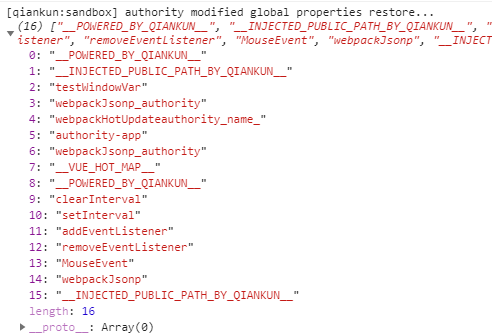

# 子应用接入
子应用的接入不需要额外安装依赖，但是需要修改入口js以及打包配置。
## 导出生命周期钩子

<h3>bootstrap</h3>

- bootstrap 只会在微应用初始化的时候调用一次，下次微应用重新进入时会直接调用 mount 钩子，不会再重复触发 bootstrap。
- 通常我们可以在这里做一些全局变量的初始化，比如不会在 unmount 阶段被销毁的应用级别的缓存等。

<h3>mount</h3>

- 应用每次进入都会调用 mount 方法。
- 通常我们在这里触发应用的渲染方法和通过 props 获取通信方法。

<h3>unmount</h3>

- 应用每次 切出/卸载 会调用的方法。
- 通常在这里我们会卸载微应用的应用实例。

<h3>update</h3>

- 可选生命周期钩子，仅使用 loadMicroApp 方式加载微应用时生效。


参考以下代码
```javascript
export async function bootstrap () {
  console.log('[user] user app bootstraped')
}

export async function mount (props) {
  console.log('[user] props from main framework', props)
  storeTest(props) // 获取与主应用通信方法
  render(props) // 渲染应用
}

export async function unmount () {
  instance.$destroy()
  instance.$el.innerHTML = ''
  instance = null
  router = null
  console.log('[user] user app unmount')
}

export async function update (props) {
  console.log('[user] update props', props)
}
```
## publicPath
不了解publicPath的作用请查看 [webpack文档](https://webpack.js.org/guides/public-path/)。
默认publicPath是 / ，参考以下例子：

- 有一个子应用运行在 http://subapp-user.com
- 那么他对应的app.js可以通过 http://subapp-user.com/app-[hash].js访问
- 当这个子应用运行在 http://main-app.com的主应用内时
- 访问app.js的路径会变成 http://main-app.com/app-[hash].js
- 显然结果是404

所以我们需要修改子应用运行时publicPath，qiankun会在子应用bootstrap之前注入一个运行时的publicPath变量，我们需要在子应用入口js顶部添加以下代码
```javascript
if (window.__POWERED_BY_QIANKUN__) {
  // eslint-disable-next-line
  __webpack_public_path__ = window.__INJECTED_PUBLIC_PATH_BY_QIANKUN__
}
```
## render
前面提到在生命周期钩子mount里渲染子应用，同时我们需要子应用也可以独立运行，添加以下代码在非qiankun环境也渲染应用
```javascript
if (!window.__POWERED_BY_QIANKUN__) {
  render()
}
```
vue-cli创建的项目创建vue实例并render的方法是下面这样的
```javascript
new Vue({
  router,
  store,
  render: h => h(App)
}).$mount('#app')
```
考虑以下两点

- 子应用在qiankun环境内是用过路由来区分的，比如用户模块是 /user 开头、文档模块是 /document 开头；而子应用独立运行时是不需要这些前缀的。所以需要在创建router实例时添加一个动态的base配置
- 子应用独立运行时通过 $mount('#app') 挂在在#app对应的dom内；而在qiankun环境内可能主应用已经有了#app对应的dom，为了避免冲突挂在的容器也要动态配置

可参考以下代码
```javascript
const packageName = require('../package.json').name

function render (props = {}) {
  const { container } = props
  router = new VueRouter({
    mode: 'history',
    base: window.__POWERED_BY_QIANKUN__ ? `/${packageName}` : '',
    routes
  })
  instance = new Vue({
    router,
    store,
    render: h => h(App)
  }).$mount(container ? container.querySelector('#app') : '#app')
}

export async function mount (props) {
  render(props)
}
```
你可能注意到使用了 packageName 作为base，后面打包配置里会说明（注意如果项目不是部署在根目录，即本身就有router.base的配置，请根据实际情况修改）。
vue-cli创建的项目内默认是在 router/index.js 内创建router实例的，所以还需要修改 router/index.js 为导出routes配置，在入口js里创建实例。
## 卸载子应用
```javascript
export async function unmount () {
  instance.$destroy()
  instance.$el.innerHTML = ''
  instance = null
  router = null
  console.log('[user] user app unmount')
}
```
参考上面的代码，卸载了vue和vue-router实例，那我在子应用内定义的全局变量比如第三方js定义的window内变量、setTimeout和setInterval、添加的各种事件等等需不需要卸载呢？
**不需要**

当从子应用跳转回主应用或者其他子应用时，会看到以下打印：



qiankun会自动重置在子应用中定义或修改了的全局属性。
## 通信
在mount钩子的props内可以获取到通信相关的方法
```javascript
function storeTest (props) {
  props.onGlobalStateChange &&
    props.onGlobalStateChange(
      (value, prev) => console.log(`[onGlobalStateChange - ${props.name}]:`, value, prev),
      true
    )
  props.setGlobalState &&
    props.setGlobalState({
      ignore: props.name,
      user: {
        name: props.name
      }
    })
}
```
onGlobalStateChange 监听数据的变化，第二个参数设为 ture 表示立即执行，类似 vue watch 的 immediate。
setGlobalState 修改数据。
通过这两个方法就可以在 主应用和子应用 或者 子应用和子应用 间传递数据了


## 完整入口示例
```javascript
import Vue from 'vue'
import App from './App.vue'
import VueRouter from 'vue-router'
import routes from './router'
import store from './store'
if (window.__POWERED_BY_QIANKUN__) {
  // eslint-disable-next-line
  __webpack_public_path__ = window.__INJECTED_PUBLIC_PATH_BY_QIANKUN__
}
const packageName = require('../package.json').name

Vue.config.productionTip = false

let router = null
let instance = null

function render (props = {}) {
  const { container } = props
  router = new VueRouter({
    mode: 'history',
    base: window.__POWERED_BY_QIANKUN__ ? `/${packageName}` : '',
    routes
  })
  instance = new Vue({
    router,
    store,
    render: h => h(App)
  }).$mount(container ? container.querySelector('#app') : '#app')
}
if (!window.__POWERED_BY_QIANKUN__) {
  render()
}

function storeTest (props) {
  props.onGlobalStateChange &&
    props.onGlobalStateChange(
      (value, prev) => console.log(`[onGlobalStateChange - ${props.name}]:`, value, prev),
      true
    )
  props.setGlobalState &&
    props.setGlobalState({
      ignore: props.name,
      user: {
        name: props.name
      }
    })
}
/**
 * bootstrap 只会在微应用初始化的时候调用一次，下次微应用重新进入时会直接调用 mount 钩子，不会再重复触发 bootstrap。
 * 通常我们可以在这里做一些全局变量的初始化，比如不会在 unmount 阶段被销毁的应用级别的缓存等。
 */
export async function bootstrap () {
  console.log('[user] user app bootstraped')
}
/**
 * 应用每次进入都会调用 mount 方法，通常我们在这里触发应用的渲染方法
 */
export async function mount (props) {
  console.log('[user] props from main framework', props)
  storeTest(props)
  render(props)
}
/**
 * 应用每次 切出/卸载 会调用的方法，通常在这里我们会卸载微应用的应用实例
 */
export async function unmount () {
  instance.$destroy()
  instance.$el.innerHTML = ''
  instance = null
  router = null
  console.log('[user] user app unmount')
}
/**
 * 可选生命周期钩子，仅使用 loadMicroApp 方式加载微应用时生效
 */
export async function update (props) {
  console.log('[user] update props', props)
}

```
## 修改打包配置

<h3>library配置：</h3>

在 vue.config.js 内添加以下配置
```javascript
const packageName = require('./package.json').name

module.exports = {
  configureWebpack: (config) => {
    config.output = {
      ...config.output,
      library: `${packageName}`,
      libraryTarget: 'umd',
      jsonpFunction: `webpackJsonp_${packageName}`
    }
  }
}
// 或者
module.exports = {
  configureWebpack: {
    output: {
      library: `${packageName}`,
      libraryTarget: 'umd',
      jsonpFunction: `webpackJsonp_${packageName}`
    }
  }
}
```
两种方式的区别可以查看 [vue-cli的webpack配置](https://cli.vuejs.org/zh/guide/webpack.html)。
library可以查看 [webpack配置](https://webpack.js.org/configuration/output/#outputlibrary)。这个配置的作用是打包出一个库，可以给主应用引用，**库名需要和主应用注册的子应用名一致，**为了避免错误我们把库名、子应用名、子应用路由base**约定统一使用package.name。**

<h3>跨域配置：</h3>

由于 qiankun 是通过 fetch 去获取微应用的引入的静态资源的，所以必须要求这些**静态资源支持跨域，包括子域名本身的静态资源和引入的第三方资源。**
本地调试我们可以修改devServer配置允许跨域：
```javascript
  module.exports = {
    devServer: {
      headers: {
        'Access-Control-Allow-Origin': '*'
      }
    }
  }
```
